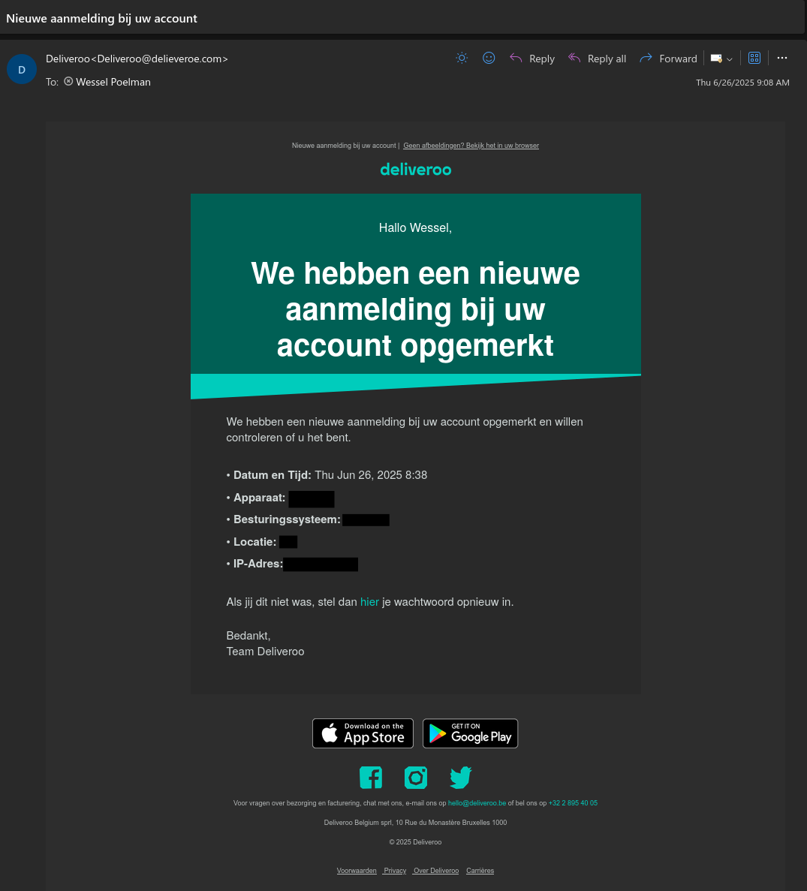
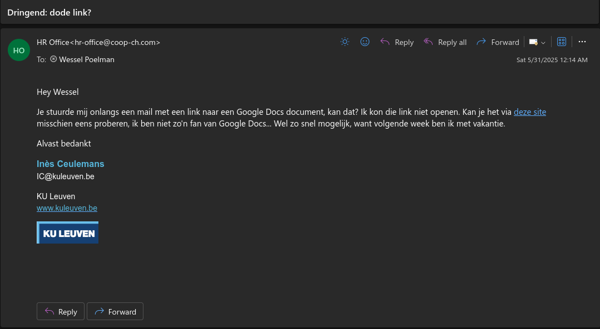

+++
title = 'Phishing Tests'
date = 2025-08-07T10:11:51+02:00
author = 'Wessel Poelman'
draft = false
+++

Human error (or gullibility) is possibly the biggest security vulnerability in any system.
Fake but convincing phone calls, emails, websites, and so on have all resulted in [breaches](https://en.wikipedia.org/wiki/2020_Twitter_account_hijacking) that undermine otherwise secure infrastructures.
Entire companies have jumped into the "market" of allegedly protecting against these vulnerabilities.
My current employer (KU Leuven) also uses such a company: https://phished.io/.
Their main way of "training" employees is to send *very* convincing emails that track if you indeed clicked on a shady link or reported the email correctly.
The emails come from many fake sources (companies, internal, etc).
A company example (notice the weird sender):

Or even a fake HR example (from Swiss Coop?):

If you've reported enough of these and complete quizzes, you get a certificate, which the people in the CS department just hang on the wall of the canteen (so basically useless).

In principle, I'm not against these phishing training, but the way there are done is frankly an enormous waste of time.
The quizzes use many dark patterns such as "YOU ONLY HAVE x DAYS TO FINISH THIS!" and other strange tactics.
I genuinely believed these quizzes were mandatory for several months and *many* colleagues with me.
They are not mandatory and nobody cares, but we still have a wall of certificates in the canteen reminding us of the many hours wasted.
The content of the quizess is insultingly easy, and I'm not saying that as a "computer-savvy" person.

> *"You get a request to pay an invoice, but the person asking is in a hurry and asks if you can do it without approval from the financial department. The email appears to be sent from a KU Leuven domain." Do you:*
> 
> a) Pay the amount since they're in a hurry and you want to be a nice colleague.
> 
> b) Verify the claim with the financial department.
> 
> c) Ask the sender for verification and then send the money.

Wow, what should I answer in a quiz about cyber security and anti-phishing...
The quizzes also contain unskippable videos demonstrating things like "you should check unknown phone numbers", "make sure you don't re-use a password" or "check with people in person if you don't trust something".
Again, I'm not against making people aware of these things, but this not the way to do it in my opinion.
Wasting time, dark patterns, too many fake emails bordering on parody (ah yes, everything is urgent and nobody "trusts" existing infrastructure) is frustrating, especially in an environment with already too many emails (and I'm just a lowly PhD student, imagine the horror professors go through).
Now, I do admit this is important, and ironically *even more so* in such an environment given the greater chance of problems, but this doesn't seem like the way to do it.
I'm not in this business, but I'd wager there's a market for someone with a good idea about how to make this not a huge and frustrating waste of time, while properly training employees.

So is there a remedy? Yes!
For the quizzes, do them if you have zero knowledge about basic internet safety, but otherwise just don't bother *in my opinion*.
For the emails, the company uses a specific `reply-to` email address for all fake spam.
Email providers generally have many options to filter incoming messages.
And that's all I'll say about that ;)

No alarms and no surprises, please.
