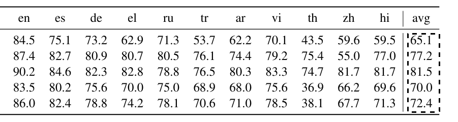

+++
title = 'A Collection of Useful Software'
date = 2025-04-17T10:09:34+01:00
author = 'Wessel Poelman'
draft = false
+++

This is random collection of useful software.
'Useful' in this context means it reduces headaches and annoyances when doing (research) work on a computer.

## dpScreenOCR
Research is a lot more messy than nicely typeset PDFs lead on.
Selecting text in a PDF in the horizontal direction is annoying (hyphens, page numbers, footer information, etc.) but it generally works.
Selecting text vertically is impossible, something even non-PDF alternatives, such as HTML versions of arXiv papers, don't resolve.
This is a shame since an enormous amount of valuable information is hard to access and process given that we're stuck with this format.

This is where [dpScreenOCR](https://danpla.github.io/dpscreenocr/en/) is a useful tool to quickly get some data.
It lets you take a screenshot of a region of text on your screen, it then feeds this into an OCR model, and copies the output to your clipboard.
The tool switches between modes, so you enter 'select mode' and once you hit the keyboard shortcut again, you exit select mode and you're done.
If I want the 'avg' column here, for example, I select it:



Which then immediately gives me this in my clipboard: 

```
65.1
77,2
81.5
70.0
72.4
```

Just one issue with a comma instead of a period.
It's not perfect, especially when differentiating between I and l or 0 and O, but it's so much better than not having it.
It saves time and annoyance because you already filter exactly what you want when selecting the area on the screen.

## Albert
I've been using Linux as my personal daily operating system for almost 10 years at this point.
When I worked as a software engineer a while ago, I had to use a Mac to be able to run IOS emulators.
I was neutral towards using a Mac, as it was 'close enough' to how I use Linux.
The one thing I grew accustomed to quickly in those two years was Spotlight, and I missed it sorely on Linux.
It lets you launch applications, find files, do quick calculations, and a lot more from a single search box.
You bring it up anywhere on top of what's on screen with CTRL+SPACE (or CMD+SPACE).
The default launchers in XFCE, Gnome, KDE, etc. don't come close to how frictionless Spotlight works.
This is when I found [Albert](https://albertlauncher.github.io/) and I've been using it daily for about 6 years.
It's the first thing I install when I have to do a fresh Linux install.
It's customizable, fast, and most importantly, frictionless.
If you click on something outside of the search box, it goes away, if you have multiple screens, it opens on the one you've focused on last, it sorts the actions by most used (or something else); I could go on, but it is so nice, it genuinely changed how I use computers.
If I have to use a Windows machine,[^1] I accidentally keep pressing CTRL+SPACE; it's muscle memory at this point.


## Submitit
For my research, I have to run quite a number of experiments on a compute cluster.
These types of cluster often run SLURM, a workload manager that assigns resources and manages the jobs you submit to it.
SLURM uses scripts to describe what resources a compute job needs, some housekeeping like where to email updates to, and the actual commands that perform the job.
This is an example of a (for me) realistic SLURM script:

```sh
#!/bin/bash
#SBATCH --clusters=<cluster-name>
#SBATCH --account=<account-name>
#SBATCH --nodes=1
#SBATCH --ntasks=4
#SBATCH --gpus-per-node=1
#SBATCH --partition=gpu_v100
#SBATCH --time=03:00:00
#SBATCH --mail-type=FAIL,BEGIN,END
#SBATCH --mail-user=my-email@cool.domain
#SBATCH --job-name=cool-job-name

# Generally some juggling of what modules to load or Python env to use.
# Then some setup of *this is my experiment folder*, *this is my working dir*, etc.

python cool_script.py
```

These scripts are fine for one-off jobs, but become cumbersome to create by hand when the number of experimental variables (and the number of jobs) increases.
I've seen many makeshift solutions where people try to compile these scripts programmatically (I've done this myself too), but this quickly becomes a mess.
Another difficulty in this is to choose *where* you want to do the plumbing of:

1. Where to store the output files.
2. Where your working dir is.
3. What modules or environment to load.
4. What to do if you want to do a dry-run that's *not* on the cluster.
5. What to do if you have to switch between cluster setups.
6. And more...

All this has to be done either via commands in the SLURM script, or in the code of the actual job; it's often a mess that's spread between the two.

This is what [`submitit`](https://github.com/facebookincubator/submitit) solves: it let's you programmatically create, submit, and monitor SLURM jobs from within Python.
It's simple and intuitive; it doesn't get in the way of the actual code of the compute jobs.
It does all the aforementioned plumbing for you and runs the jobs with the environment you used to submit the jobs with.
Combined with some simple config files, it becomes trivial to switch between compute clusters, even from within the same script that submits all your jobs.
Say you don't need huge GPU resources for a inference run; you can add a line of Python that switches the config from h100s to v100s for a particular batch of jobs.
The example from above becomes:

```python
import submitit


def expensive_function(a: int, b: int) -> int:
   return a + b

# Either define 'manually' or read in from a config file
parameters = {
   "slurm_partition": "gpu_v100",
   "slurm_time": "03:00:00",
   "slurm_job_name": "cool-job-name",
   "slurm_additional_parameters": {
      "clusters": "<cluster-name>",
      "account": "<account-name>",
      "nodes": 1,
      "cpus_per_gpu": 64,
      "gpus_per_node": 1,
      "mail_type": "BEGIN,END,FAIL",
      "mail_user": "my-email@cool.domain", 
   },
}

# All logs and slurm files will be stored in this folder
executor = submitit.AutoExecutor(folder="cool-job")
executor.update_parameters(**parameters)

# Submit the function with its parameters
job = executor.submit(expensive_function, 5, 7)

# This waits for completion and returns output, often not a good idea 
# with long jobs, then you can just let this script finish.
output = job.result()
```

The one thing that requires some fiddling to set up is the `slurm_additional_parameters` field.
I had to figure out what cluster-specific variables I had to set there to make it work.
This will be different from cluster to cluster.
If you run into trouble, it's worth looking into missing required variables which are not 'standard'; they likely need to go here.
It's basically the "kwargs" mechanism from Python; it will pass along all variables defined in that dict to the SLURM script `submitit` creates for you.
If this is set properly, it's works well.

I specifically select the `AutoExecutor` here, which, as the name suggests, automatically determines where to run your job.
If it has no access to SLURM, it will run your 'compute function' locally, if it does have access, it will submit it as a job.
No config or arguments needed.
Lastly, I use `submitit` a lot in combination with `itertools`; I define lists of values I want per experimental variable and create the product of those, which then become my compute jobs.

```python
import itertools


# Whatever your experimental variables are...
def experiment_function(number_of_items: int, subset: str, with_rounding: bool) -> None:
    ...

exp_var_1 = [1, 2, 3]
exp_var_2 = ["a", "b", "c"]
exp_var_3 = [True, False]

for exp_args in itertools.product(exp_var_1, exp_var_2, exp_var_3):
   # You can choose to update the job name parameter here, it depends on 
   # what's a useful mental model for the situation: one job per experiment 
   # or multiple jobs per experiment, etc.
   executor.submit(experiment_function, *exp_args)

# This submits jobs (without waiting for them to complete) for:
# [(1, 'a', True),
#  (1, 'a', False),
#  (1, 'b', True),
#  (1, 'b', False),
#  (1, 'c', True),
#  (1, 'c', False),
#  (2, 'a', True),
#  ...]
```

## Browser Extensions
* [GitHub Enhanced](https://github.com/refined-github/refined-github) fixes a lot of annoyances of using GitHub. The quality-of-life features it adds are generally well thought out.
* [Unpaywall](https://unpaywall.org/) tries to find open access versions of research articles behind a paywall. I'm luckily in a field where the vast majority of research is openly available, but it has helped occasionally, especially with older articles. 
* [Unhook](https://unhook.app/) hides everything on Youtube except for the search bar. I generally don't use Youtube on my laptop, but sometimes I watch a keynote or lecture for work and don't want to see piles of distracting algorithmic crap when I do.

## Python Development
Python as a language is nice to use, Python as a development 'ecosystem' is cumbersome at best and a huge anti-pattern at worst.
Over the years, I've tried Conda, Poetry, pyenv, manual setups, etc.
I currently have a [decent setup](https://github.com/WPoelman/template) that works for me, which I also recommend to students, but it's still quite cumbersome.
Someone recently recommended [uv](https://github.com/astral-sh/uv) and it seems extremely promising.
I've yet to use it extensively, but I thought I'd put it here as it holds a lot of promise.

Finally, I also recommend [pre-commit](https://pre-commit.com/) (it's also included in my setup mentioned previously).
It can do many things, but it's mainly used as a way to keep your git repos clean and safe.
It runs fixes and checks you specify which *have to be met* for you to even push your changes.
This can include things like "remove all trailing whitespace", "format Markdown", "check dependencies for security issues", "format Python", "pass tests", "don't upload things that look like API keys", etc.
I've used it as a CI/CD framework at a previous job, I use it in my own repos (mostly), and it generally works well once it's set up properly.


[^1]: I occasionally write software for a computer in a physics lab that *has* to have Windows on it for some proprietary drivers for measurement instruments.
